> 本篇论文是 FSE'23 的 distinguished paper。本文注重于 Deep Learning Library 的测试，提出了NEURI fuzzer，在 4 个月的测试中，找到了 100 个新的 bug，其中81个被 fix  或者confirm 了。

众所周知，深度学习的火热带动了一众 Deep Learning Framework 的蓬勃发展，例如 Pytorch、TensorFlow。因此这一系列 DL 的开发基座的安全性、稳定性就相当重要。

目前的深度学习框架的测试面临着测试用例生成的问题：合成一个DNN模型的结构，以及对应的输入。（注：类比于[上一篇推文](https://mp.weixin.qq.com/s/GIqrS9VWTvs8rPZzCmE09Q)，针对 Python Interpreter 的测试，既需要 Python 程序，也需要程序对应的输入）。

其中，对于生成的模型有两个重要的要求：

1. 多样性：为了测试这类 DL 系统，需要使用多种 API 及其不同的组合方式。另外也需要生成包含多种类型的 operator，从而能够测试到 Compiler 里不同的 passes。

1. 合法性：DNN 模型还是属于程序，所以需要遵守对应的约束。如果任意组合 operator 以及对应的参数，那么通常来说就会违反约束。从而在编译器早期的约束检查阶段就被检测出来，导致无法找到深层的bug。

## 现状

现有的工作里有较多的针对单个 API 的测试，他们能够生成大量的 API 调用，包括 operator 和其他的一些实用性的函数，这些 API 调用是能够做到符合对应的约束的。但是我们能直接把这些内容拿过来，进行一定的组合，来生成有效的 DNN 模型吗？

答案是不行。因为构造一个合法的API调用还需要满足 operator 内细粒度的约束（原文为：Because constructing a valid API invocation further requires satisfying fine-grained constraints between operator attributes）。然后作者用下方的图来说明目前工作的现状，以及他们的目标。

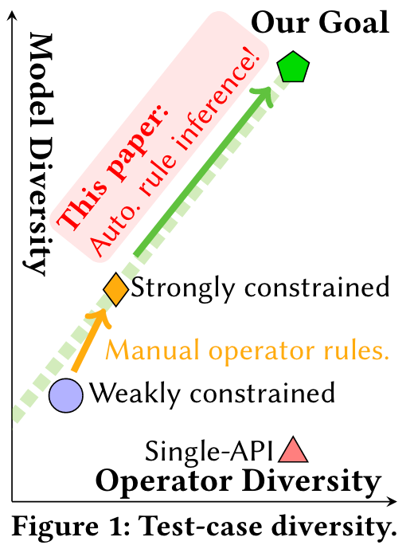

针对 Single-API，此处论文里举了一个例子，但我觉得不是很妥。

作者说 single-API tester 虽然能知道 conv2d 接受的参数是一个图片，以及对应的 weight tensor，但是他们（single-API tester）新创建的 conv2d 调用中并不能保证通道的维度与权重是匹配的，所以会导致调用失败。

然后作者提出，如果不理解这些细粒度的约束，就不可能正确地组合各种 API 来构建格式良好且多样化的模型。直观地，在图 1 中，当 API 被有效构建时，先前的单 API 测试人员可以实现理想的 API 多样性。然而，多样性很难在模型方面扩展，这需要同时构建和正确“连接”多个 API。

> 论文作者这样的介绍，就出现了一个 Gap：上一段是在讲一个 single-API（即 conv2d），由于 **API 之内**的约束没有被满足，导致无法进一步测试的问题；但下一段就转到了 API 和 API 之间的约束，中间缺少了一些必要的过渡。并且很容易提出一个问题：
>
> **如果单个API内的约束没有被这些single-API识别到，那么就无法运行这单个API，如果无法运行，那么前人是如何测试这些单个API的呢？**这部分的结论就与之前作者提到的矛盾。

但是小编认为，论文作者可能是想要给出这样的一个例子：在下面的代码中展示了一个正确的API调用和错误的API调用。其中，image 和 weight 是通过 torch.rand() 构造的。如果想要正确地运行 conv2d，就需要提前知道 image 和 weight 有这个约束，从而在使用 torch.rand() 构造时就保证符合维度的约束。从而过渡到多个 API 之间的约束上。（即图中的三角形过渡为五边形）

```python
# 函数签名: Conv2d(in_channels, out_channels, kernel_size, stride=1, padding=0, dilation=1, groups=1, bias=True)

# 正确的使用方式
# 创建一个具有1个通道的图像（例如，灰度图），大小为10x10
image = torch.rand(1, 1, 10, 10)  # (batch_size, channels, height, width)
# 创建一个匹配的权重张量，具有1个输入通道和1个输出通道，卷积核大小为3x3
weight = torch.rand(1, 1, 3, 3)  # (out_channels, in_channels, height, width)

# 正确的调用
output = F.conv2d(image, weight)

# 错误的使用方式
# 创建一个具有不匹配通道数的权重张量，例如，有3个输入通道
wrong_weight = torch.rand(1, 3, 3, 3)  # 这里的3个输入通道与图像的1个通道不匹配
output = F.conv2d(image, wrong_weight)  # 这将抛出一个错误，因为通道维度不匹配
```

后续的研究现状小编不再赘述，总而言之就是目前的工作要么只有 validity，要么只有 diversity，要么很费人力。作者想要提出一个全部拉满的 NEURI，又valid，又diverse，还automatic。

## 相关背景介绍

不了解 DL system 的读者可能不太清楚 operator 在 DL system 里到底指什么（包括小编），因此简单了解一下 operator。

Operator 可以简单被理解为就是一个函数，有对应的输入和输出，代表着在神经网络计算中常见的操作，例如 tensor 的计算、激活函数、卷积操作等。只不过这些函数通常可以使用 GPU 或其他硬件来加速计算。

对于不同的 Operator，就会有不同的内部约束，或称为 rules。这类 rules 是被隐式定义的，并不能直接导出这类rules。在 NNSmith 中（同一批团队），这些都是手动指定的。为了将这个过程自动化，作者们将 operator 形式化成三个部分，下面以 avg_pool2d 为例：

```python
avg_pool2d(input, kernel_size, stride=None, padding=0, ceil_mode=False, count_include_pad=True, divisor_override=None) → Tensor
```

该 operator 接受一个 tensor 输入（input），和相关的参数，例如 kernel_size（核的大小），stride（步长）等。其中，`input` 与 `kernel_size` 之间隐含着一个约束：`input` 的大小必须大于 `kernel_size`。这里，作者用了三个符号来形式化一个operator：

* operator的类型。即函数名

* 符号`I`，代表输入的形状向量（shape vector）

* 符号`A`，代表operator的属性。

* 符号`O`，代表输出的形状（output shape）

### 输入的约束

作者定义了输入的constraint的符号：`C`，`C`是一个基于`A`和`I`的谓词函数。例如，下方的公式表示的一个约束是kernel的高应该小于输入张量的高+2倍的padding高度。

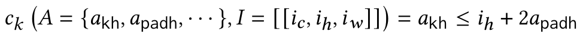

### 形状的传播（shape propagation）

形状的传播可以被形式化为一个函数`P`，这个函数接受`A`和`I`，然后输出对应的输出张量的形状。例如，对于`avg_pool2d`，输出张量的高度是`(input_height+2*padding-kernel_height)/stride+1`。

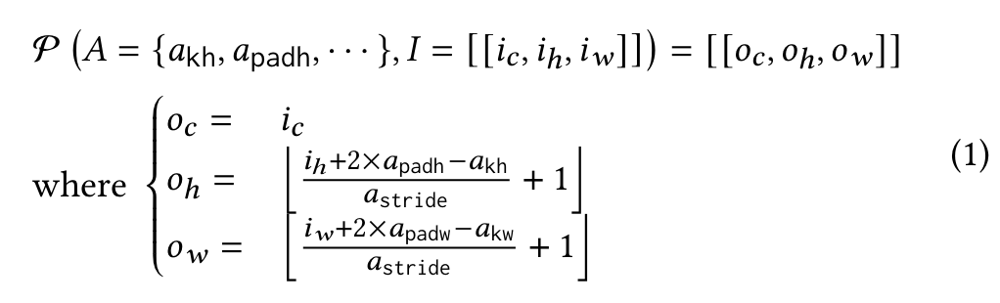

## 方法

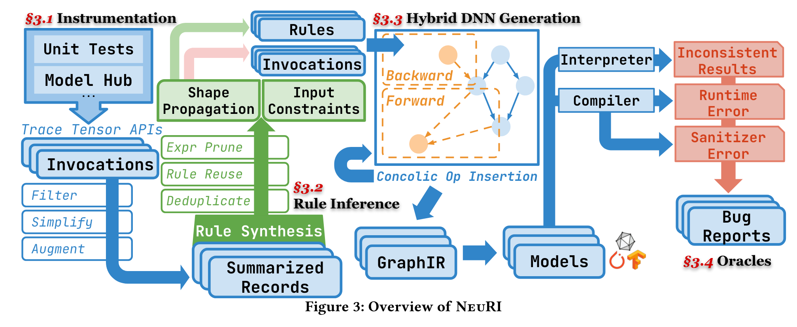

### **改进模型生成搜索空间**

#### 采集信息

论文中，作者**只关注与 tensor 相关的API**，因为其他高级的API都可以被分解成一系列的tensor API。并且**要求这些API都是确定性的，且与值无关的**。

采集的来源是 Python 的 API。采集的信息是上文提到的 I、A 和 O。这些均是简化之后的信息，尽量减少了 concrete 的信息，例如input tensor里具体的值是什么。

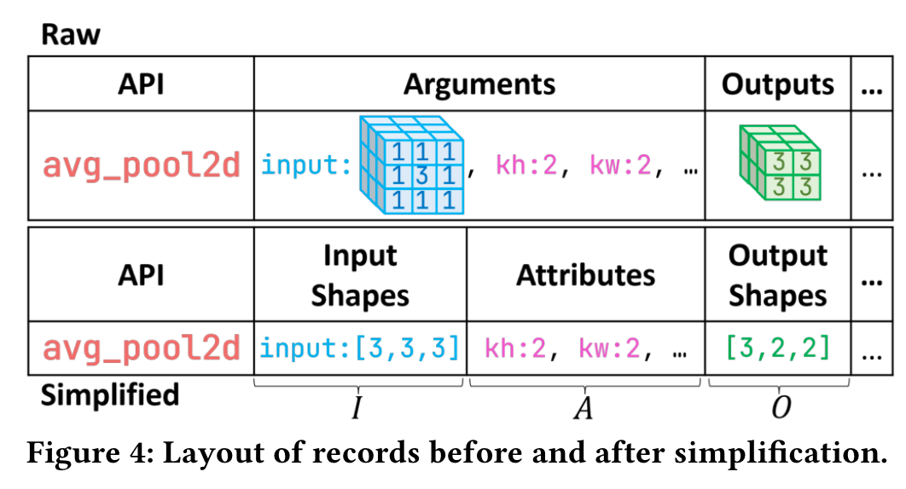

#### 数据增强

类似于模型训练，在推理可能的 rules 时，如果只是用采集到的信息，每条 rule 可能只会有 5-7 条数据，通过这种少量的数据推理出来的 rule 可能不是很健壮（可能只是在这几条数据中发现了特定的 rule）。因此需要通过一些方法（突变）来增加数据集。

文中，作者将合法的突变产物称为 passing example，不合法的突变产物称为 counter example。突变基于输入的 shape dimension 和 attributes。（就是 A 与 I 的并集）。

突变的步骤是：

1. 基于 offset 做变换：这一步的目的是为了快速构造一些 passing examples。方法很简单，枚举 $A \cup I$的子集，对于每一个子集，都使其中的元素加一，直到达到固定的数量，或者超时。（这里使用到的假设是 validity locality，有的时候valid的case只需要很少的变换就可以得到一个新的）

2. 交换：交换 $A\cup I$中的两个值可以很快地验证简单的不相等性。比如，假设$a>b$在所有采集到的passing example中都成立，那么可以通过交换a和b的值来验证是否依然成立。如果不成立，那么这个rule就被推翻了。

3. 特殊值。随机给某些 attributes 赋特殊值，例如 0, -1 等，以此来测试 attribute 的 negativity。

除此以外，如果没有 counter example 产生，那么意味着对应的 operator 没有任何输入约束（或者约束很弱）。

## 规则推导

论文通过一个简单的算数语法来推导约束（或规则，指$A\cup I \cup O$之间的规则）

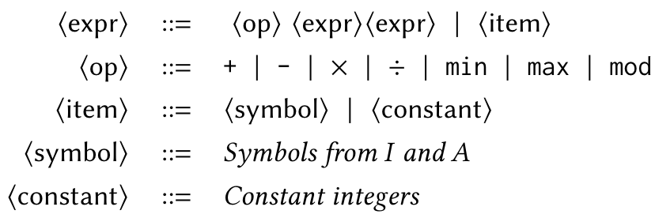

有了这个语法，就能够通过**遍历**可能的数学表达式，来构造可能的$|A|,|I|,|O|$之间的关系（并且这个算数表达式最后都可以被归一化到 $0<expr$ 或者 $0=expr$ 的形式）。由于实际上的表达式往往很短，所以论文中使用的是自下而上搜索，先枚举item，然后逐步将其组合，以生成更大的表达式。

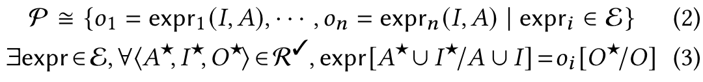

在上面的公式中，NeuRI会枚举$\varepsilon$里的expr，对于这个expr，要求对于任意的$A,I,O$都能够用 expr 来描述 A、I、O的关系。如果不满足，那么就推导不出该规则。下方的算法是对这个过程的形式化描述。

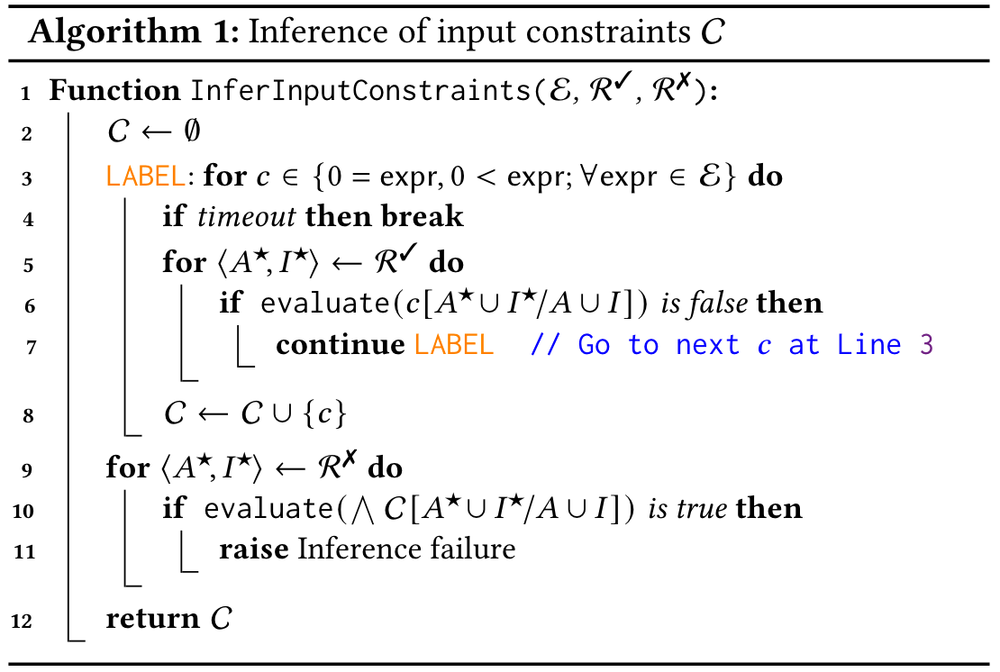

接下来，论文引入了一个新的概念：Partial Operator。（但小编没有太 get 到这部分的作用）

文中首先提到，在NNSmith中，operator rules是直接用Python写的，语法比 G（上文提到的算数语法）复杂得多。如果基于Python的语法来进行合成规则的话，是不可行的。

接着文中画风一转，作者提出：为了保持像 G 这样简单的语法，我们通过固定部分组件，将一个运算符拆分为多个部分运算符。

> 结合后文，小编大概能get到作者的意图是想要把类似的operator统一起来，从而减少所有要处理的operator数量。但在这里，总让人觉得这样的描述仅仅是为了与 NNSmith 保持兼容。假设抛开NNSmith，那么小编并没有感觉到这一部分有什么特别的必要性，理由是通过A、I的集合，加上G语法的约束，已经能够达到一样的推导效果。欢迎读者一起讨论~

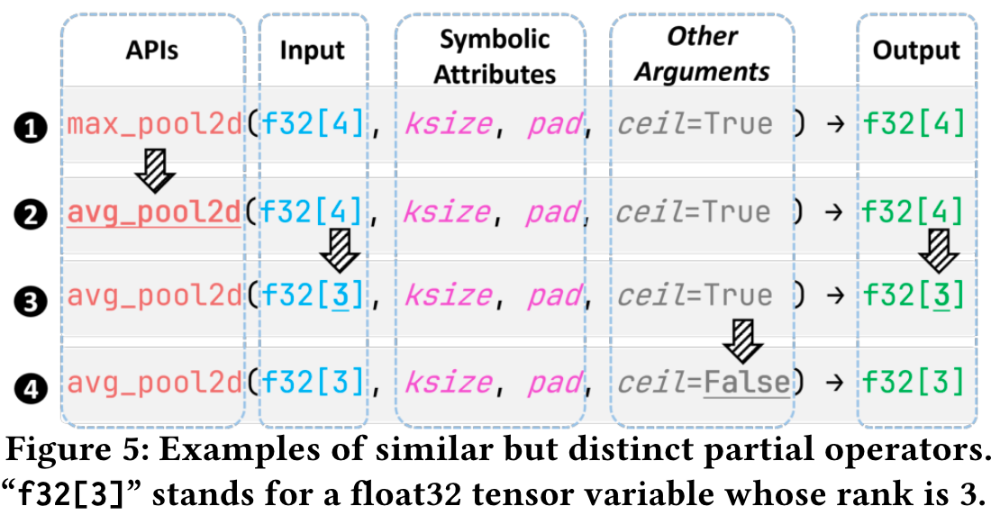

文中给出了一个例子来说明是如何区分 partial operator的。

1. 函数签名。例如圈1和圈2，这两者完全相同（input和ouput有相同的维度，那么定义为一个partial operator），则认为他们是同一个operator。但圈2和圈3的partial operator不同，因为圈2和圈3的input和output里的维度不同。
2. 符号属性（Symbolic attributes）。如图所示，这类属性是 operator rule里的自由变量，对于有不同属性的api调用，会被关联不同的partial operator。
3. 其他参数（非tensor、非symbolic integer）。大致分为两类：与rule正交的参数；和只会用于识别partial operator对operator rule的潜在影响。第一类举个例子是输入图片的layout是NCHW还是NHWC。第二类就是圈3和圈4里的ceil参数，因为ceil会影响avg_pool2d的形状传播规则。

### 剪枝

尽管G语法已经相当简单，但是搜索空间依旧很大。因此作者对等价、稀有的表达式进行了剪枝。

1. 确认边界。如果没有约束的话，G语法派生出来的表达式是无限的。所以通过限制 op 的数量，以及 constant 的采样集合，就减少了搜索空间。例如，文中限制了 op 最多有5个，constant只能是 {1, 2} 中的一个。
2. 稀有度。把不常见的表达式给删了。例如<op>, <constant> <constant>，这种比较两个常数大小的表达式是没有意义的。
3. 等价性。如果两个表达式有相同的free variable，那么就使用一些随机的值去填充这两个表达式。然后两个表达式会产生相同或者不同的输出，通过这些输出，先把表达式进行快速聚类。针对每一个类别，再使用smt solver来严格找到等价类。

### 规则重用

Partial operator能够共享等价的rules（小编对此持怀疑态度，因为没有证据表明Partial Operator真的能共享rules）。文中表示，如果一个operator的A、I、O与之前已经推导出约束的partial operator一致，那么可以直接复用rules。

### 规则去重

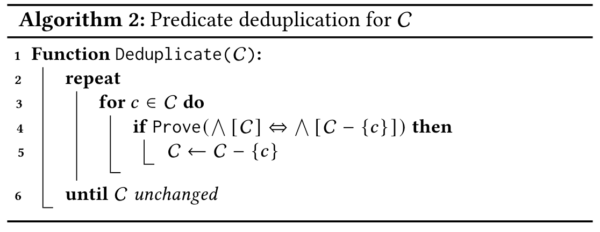

如果去掉c和没去掉C是等价的，那么表明c是冗余的。

## 实验对比

论文提出了三个RQ：

1. NeuRI与其他SOTA相比，code coverage如何？
2. 分别采集和推导出来了多少API、Partial Opertor和records？与其他通用的progra synthesis工具相比效率如何？
3. NeuRI找到了多少新bug？

论文对 TensorFlow 和 Pytorch 两个框架进行了测试。

对比的baseline是 NNSmith、Muffin（这两个是model level的fuzzer）、DeepREL（Operator level的fuzzer）以及没有符号推导的NeuRI、只有符号推导的NeuRI（消融实验）。

对比的指标是找到的bug数量以及分支覆盖率。

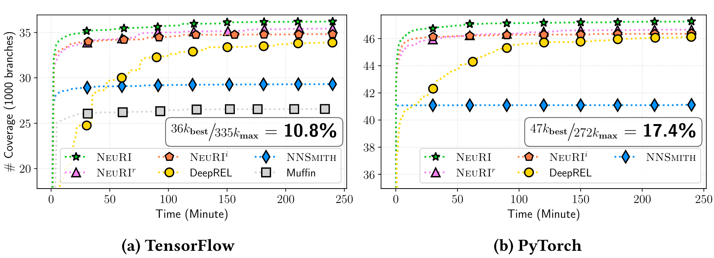

如图所示，NeuRI及其变种都超过了现有SOTA。并且值得注意的是，NeuRI只使用了一部分的Operator（基础Operator），但覆盖率依旧超过了针对Operator的DeepREL。

另外，NeuRI分别在TensorFlow和Pytorch上达到了10.8%和17.4%的覆盖率。这个数量并不算少，因为一些linux 的fuzzer通常只能达到10%的覆盖率（百万行代码）。

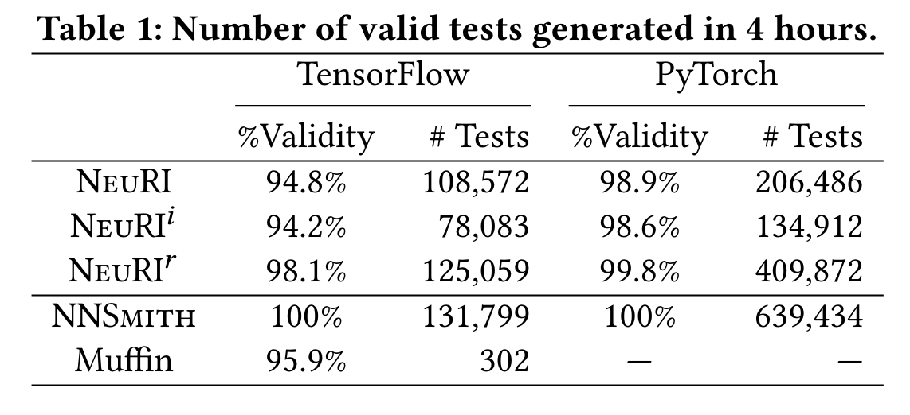

对于生成测试用例的质量，在同样的4小时内，NeuRI比NNSmith更慢，因为多了约束推理和求解的步骤。在去掉了自动推理后（NeuRI^r），速度比只有推理的NeuRI^i更快。结合上面的覆盖率信息，可以发现两种操作（rule inferen和concrete operator）都是有用的，能够带来一定覆盖率增长，但并不是非常明显。

另外作者还讨论了关于超参数的设置对覆盖率带来的影响。如下图所示，在实验默认设置下，grammar G里的最大op数量是5。下图对比了不同的op下，在给定的时间里能达到的覆盖率。结果显示如果只有一个op的话，结果就比较糟糕，但是5个、9个、13个的话就不相上下。

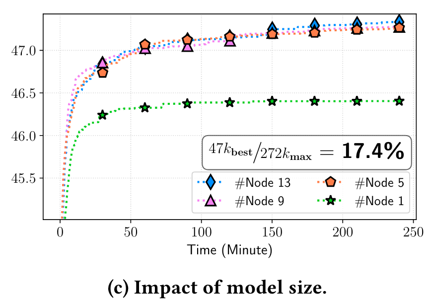

关于推理出来的oprator的分布，如下图所示。作者分别在Pytorch和TensorFlow中采集了758条和248条API，大约是百分之50多。因为其他的API要么没有测试，要么是跟tensor无关的API，所以没有采集。其中这里采集到的records分别是63136和33973条。平均一个API有大约10条的records。

在过滤了不想要的API（要求确定性的、结果不会随着状态或者输入的值改变）后，分别剩余681和214条API，以及29589和12908条records。经过数据增强后，patial operator的数量分别达到了5875和1799，records数量分别达到了1041459和303314。

对于每个rule给定1000s的budget，NeuRI分别能够推理620和192条API的rules，patial API则分别是4475和1507条。其中，分别有604和185条在fuzzing过程中被使用了（表格倒数第二行），并且有582和176条仔使用过程中一直能构建正确用例（表格倒数第三行）。所以整体的效果还是不错的。

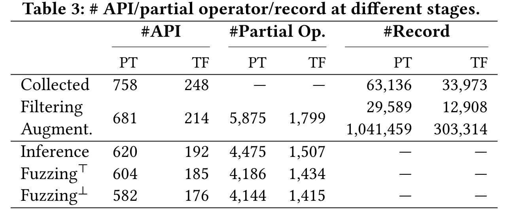

作者还对约束求解的时间进行了分析。结果表明大部分的约束求解规模还是比较小的（大部分小于1s就能求解完成），但是随着符号的增加，会出现求解时间长，甚至超时的情况（123个求解失败）。

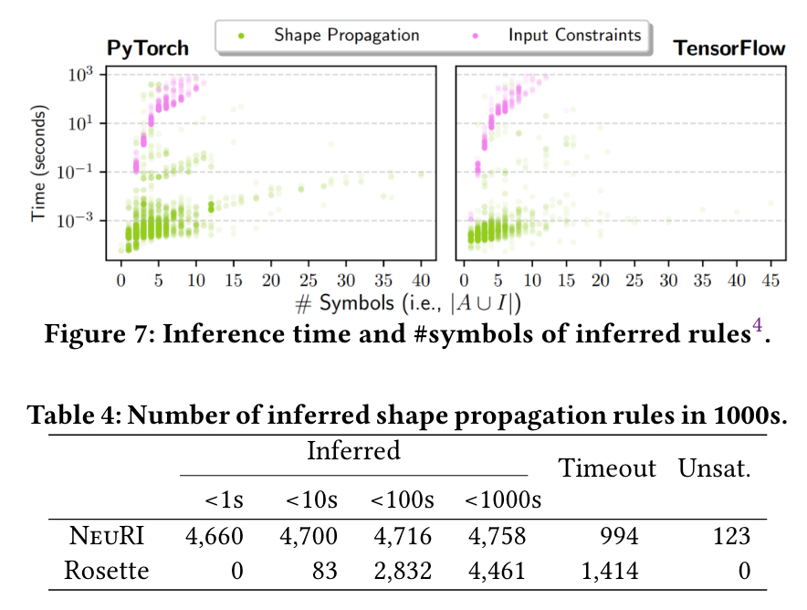

作者还对剪枝的效果进行了分析。结果表明在剪枝后，搜索空间的大小在数量级上有了缩减。

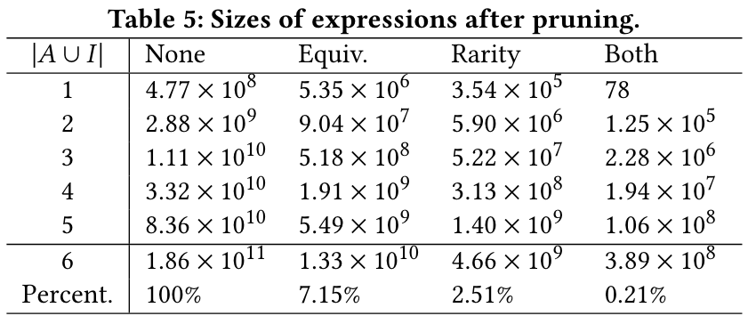

在找bug的能力方面，作者找到了100个新bug，数量相当可观。

## 总结

这篇论文是NNSmith的后续工作，其基于NNSmith的model生成模式进行改进，从人工定义operator rules升级成了自动推导operator rules。为了达到这个目标，论文首先定义了问题的scope（基于tensor的API），并且定义了constraint的scope（A、I和O之间的关系）。使用算数语法G来描述constraint，然后使用SMT来求解这些约束。其中，为了减少SMT求解的overhead，使用了大量的剪枝手段来减少搜索空间（例如简化API描述，仅使用简单的结构表示，以此对operator进行聚类；对rule的op数量进行限制；删除稀有、等价的rule等）。最后依托于NNSmith的DNN生成，完成了NeuRI这个工作。

实验部分比较完整，对于外部的SOTA有效率（code coverage）上的比较。在实现内部，针对不同的技术带来的效益变化也有一个详细的展示（不同的model size对coverage的影响；多少API在fuzzing过程中被使用等）。因此，本论文是一篇比较完整、充分的工作。
