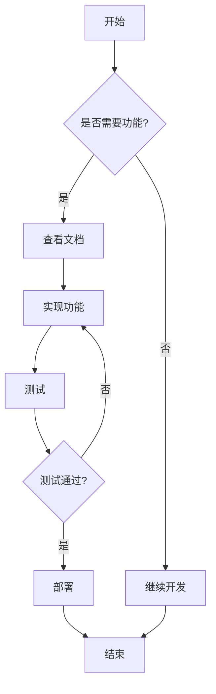
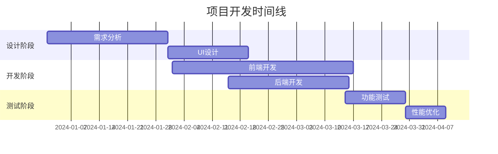
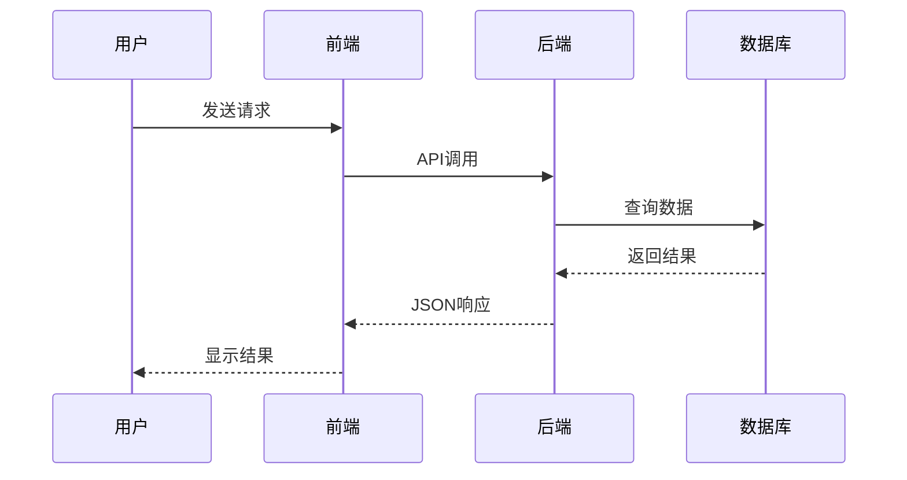

欢迎来到Hugo Blox Builder功能展示页面！这里将演示各种强大的内容创作功能。

## 📝 基础文本格式

这是**粗体文本**，这是*斜体文本*，这是~~删除线文本~~。

你可以创建`内联代码`，也可以创建[链接](https://hugoblox.com)。

## 🔗 各种链接类型

### 内部链接
- [链接到项目页面]()
- [链接到演讲页面]()
- [滚动到数学公式部分](#数学公式)

### 外部链接
- [访问Google](https://www.google.com)
- [Hugo Blox官网](https://hugoblox.com)

### 文件链接
[下载我的简历](/uploads/resume.pdf)

## 🔢 脚注示例

这里有一个脚注的例子[^1]，还有另一个脚注[^2]。

[^1]: 这是第一个脚注的内容。
[^2]: 这是第二个脚注，可以包含更多详细信息。

## 🖼️ 图片展示

### 单张图片


### 带ID的图片（可交叉引用）


如图[1](#figure-logo)所示，这是Hugo Blox的标志。

### 内联图标
 Python  
 R  
 特效  

## 😊 表情符号

我 :heart: Hugo Blox :smile:

你也可以直接使用: 🚀 🎉 💡 📚 🔬

## 💡 提示框

{}
这是一个提示框，用于显示重要信息、提示或定义。
{}

{}
这是一个警告框，用于显示重要的警告信息！
{}

## 🎥 视频嵌入

### YouTube视频


### Bilibili视频


## 🧠 思维导图

```markmap {height="300px"}
- Hugo Blox功能
  - 内容创作
    - Markdown支持
    - 数学公式
    - 代码高亮
  - 媒体集成
    - 图片
    - 视频
    - 音频
  - 交互功能
    - 评论系统
    - 分享按钮
    - 搜索功能
  - 可视化
    - 图表
    - 思维导图
    - 流程图
```

## 📊 流程图



## 📅 甘特图



## 🔄 序列图



## 💻 代码高亮

### Python代码
```python
def fibonacci(n):
    """计算斐波那契数列"""
    if n <= 1:
        return n
    return fibonacci(n-1) + fibonacci(n-2)

# 使用示例
for i in range(10):
    print(f"F({i}) = {fibonacci(i)}")
```

### JavaScript代码
```javascript
// 异步函数示例
async function fetchData(url) {
    try {
        const response = await fetch(url);
        const data = await response.json();
        return data;
    } catch (error) {
        console.error('获取数据失败:', error);
        throw error;
    }
}

// 使用示例
fetchData('https://api.example.com/data')
    .then(data => console.log(data))
    .catch(error => console.error(error));
```

## 🧮 数学公式

### 内联数学
这是一个内联数学公式：$E = mc^2$

### 块级数学公式

$$
\gamma_{n} = \frac{ \left | \left (\mathbf x_{n} - \mathbf x_{n-1} \right )^T \left [\nabla F (\mathbf x_{n}) - \nabla F (\mathbf x_{n-1}) \right ] \right |}{\left \|\nabla F(\mathbf{x}_{n}) - \nabla F(\mathbf{x}_{n-1}) \right \|^2}
$$


### 多行数学公式

$$f(k;p_{0}^{*}) = \begin{cases}
p_{0}^{*} & \text{if }k=1, \\
1-p_{0}^{*} & \text{if }k=0.
\end{cases}$$


## 📊 表格展示

### Markdown表格
| 功能 | 支持程度 | 说明 |
|------|----------|------|
| 数学公式 | ✅ 完全支持 | LaTeX语法 |
| 代码高亮 | ✅ 完全支持 | 多种语言 |
| 图表 | ✅ 完全支持 | Plotly/Mermaid |
| 视频 | ✅ 完全支持 | YouTube/本地 |
| 音频 | ✅ 完全支持 | 多种格式 |

### CSV表格


## 🏷️ 标签和分类

当前页面的标签：Hugo Blox, 功能展示, Markdown

当前页面的分类：教程

## 🎯 行动按钮

<div style="text-align: center; margin: 20px 0;">
  <a href="https://hugoblox.com" target="_blank" style="background: #007bff; color: white; padding: 12px 24px; text-decoration: none; border-radius: 5px; display: inline-block; margin: 10px;">开始使用Hugo Blox</a>
  <a href="https://github.com/HugoBlox/hugo-blox-builder" target="_blank" style="background: #28a745; color: white; padding: 12px 24px; text-decoration: none; border-radius: 5px; display: inline-block; margin: 10px;">查看源代码</a>
</div>

## 👤 提及用户

感谢 {} 对这个项目的贡献！

## 📝 包含Markdown文件

{}

## 🔍 下标和上标

化学公式：H<sub>2</sub>O 和 CO<sub>2</sub>

数学表达式：x<sup>2</sup> + y<sup>2</sup> = z<sup>2</sup>

使用数学模式：$H_2O$ 和 $x^2 + y^2 = z^2$

## 🎨 自定义样式

<div style="background: linear-gradient(45deg, #ff6b6b, #4ecdc4); padding: 20px; border-radius: 10px; color: white; text-align: center; margin: 20px 0;">
  <h3>自定义样式区块</h3>
  <p>这是一个使用自定义CSS样式的区块，展示了HTML和CSS的集成能力。</p>
</div>

## 📚 总结

Hugo Blox Builder提供了丰富的内容创作功能，包括：

1. **文本格式化** - 支持各种Markdown语法
2. **数学公式** - 完整的LaTeX支持
3. **代码高亮** - 多种编程语言支持
4. **媒体集成** - 图片、视频、音频嵌入
5. **数据可视化** - 图表、思维导图、流程图
6. **交互功能** - 评论、分享、搜索
7. **自定义样式** - CSS和HTML集成

这些功能让你能够创建专业、美观、功能丰富的学术网站！

---

*这篇文章展示了Hugo Blox Builder的主要功能。更多详细信息请参考[官方文档](https://docs.hugoblox.com)。*